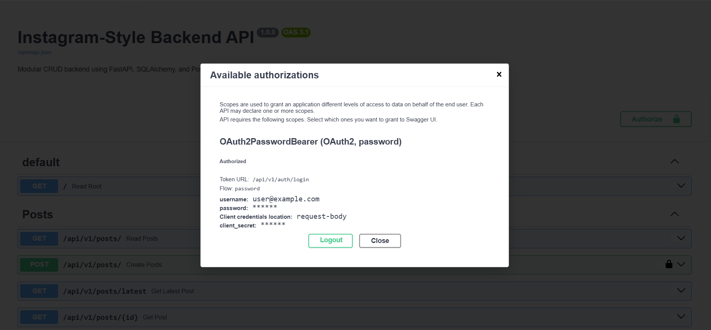

## follow up link
https://github.com/abhishekmannatharaj/pandas-analytics.git

## Run fastapi

```powershell
# Create a fresh local Python execution sandbox environment
py -3 -m venv venv

# Activate your newly provisioned virtual sandbox infrastructure
.\venv\Scripts\Activate.ps1

# Bind and resolve all project framework and production module packages
pip install -r requirements.txt
```
## docker

 docker compose up --build -d
 docker compose up -d
 docker compose down

# FastAPI Instagram-Style Backend Service

A modular backend CRUD API built with **FastAPI** and **PostgreSQL**, structured according to production best practices with versioned routing and segregated schemas.

## FastAPI & CRUD Operations Cheat Sheet

This service implements a modular, database-backed RESTful API following standard HTTP semantics and the active record / ORM repository pattern.

---

### Core CRUD Endpoints Matrix

| HTTP Verb | Path | Action / Operation | Status Code | Request Body | Response Model | Idempotent? |
| :--- | :--- | :--- | :--- | :--- | :--- | :--- |
| `POST` | `/api/v1/posts/` | **Create** a new post | `201 Created` | `PostCreate` | `PostResponse` | No |
| `GET` | `/api/v1/posts/` | **Read** all posts | `200 OK` | *None* | `List[PostResponse]` | Yes |
| `GET` | `/api/v1/posts/{id}` | **Read** a single post by ID | `200 OK` | *None* | `PostResponse` | Yes |
| `GET` | `/api/v1/posts/latest`| **Read** the most recently created post | `200 OK` | *None* | `PostResponse` | Yes |
| `PUT` | `/api/v1/posts/{id}` | **Update** / Replace an existing post | `200 OK` | `PostCreate` | `PostResponse` | Yes |
| `DELETE`| `/api/v1/posts/{id}` | **Delete** a post record | `204 No Content` | *None* | *None (Empty)* | Yes |

---

### Key Architectural Concepts

* **FastAPI Dependency Injection (`Depends(get_db)`):** 
  Guarantees that an isolated SQLAlchemy session is generated per request and systematically closed inside a `finally` block once the response is returned, preventing database connection leaks.
* **Separation of Schemas and Models:**
  * **Pydantic Schemas (`schemas.py`):** Define the wire format and validation contracts for incoming JSON payloads (`PostCreate`) and outgoing serializations (`PostResponse`).
  * **SQLAlchemy Models (`models.py`):** Define the physical PostgreSQL schema (tables, constraints, primary keys, and server defaults).
* **Automatic ORM Serialization (`from_attributes = True`):** 
  Enables Pydantic v2 to inspect attributes directly off native SQLAlchemy model instances and format them into JSON responses without manual dictionary transformations.
* **Database-Enforced Timestamps:** 
  Uses `server_default=text("now()")` in PostgreSQL to ensure the database engine stamps creation times precisely, removing clock-skew issues between servers.

---

### CRUD Request Lifecycle Workflow

```mermaid
sequenceDiagram
    autonumber
    actor Client as Client / Frontend
    participant Route as FastAPI Router (/posts)
    participant Schema as Pydantic (PostCreate)
    participant DB as SQLAlchemy Session (get_db)
    participant PG as PostgreSQL Engine

    Client->>Route: POST /api/v1/posts/ (JSON Payload)
    Route->>Schema: Validate JSON structure
    alt Schema Validation Fails
        Schema-->>Client: 422 Unprocessable Entity
    else Schema Validation Passes
        Route->>DB: Open Session (yield db)
        Route->>DB: Instantiate Post(**post.model_dump())
        Route->>PG: INSERT INTO posts ... RETURNING *
        PG-->>DB: Raw Row Record
        Route->>DB: db.commit() & db.refresh()
        Route-->>Client: 201 Created (Serialized PostResponse)
        Route->>DB: db.close() (Session cleanup)
    end

---
## Authentication & Security Cheat Sheet

This API implements stateless **OAuth2 Password Bearer Authentication** using signed **JSON Web Tokens (JWT)** and **bcrypt** password hashing.

---

### Key Authentication Endpoints

| Method | Endpoint | Description | Auth Required? | Payload Type |
| :--- | :--- | :--- | :--- | :--- |
| `POST` | `/api/v1/auth/register` | Registers a new user account and stores a salted `bcrypt` password hash. | No | `application/json` |
| `POST` | `/api/v1/auth/login` | Validates credentials and returns an encoded JWT access token. | No | `x-www-form-urlencoded` |
| `POST` | `/api/v1/posts/` | Creates a new post (protected route). | **Yes (Bearer Token)** | `application/json` |

---

### Core Security Architecture

* **One-Way Password Hashing (`bcrypt`):** Raw passwords are never stored in plain text[cite: 1]. Passwords are automatically salted and hashed before persistence, neutralizing rainbow-table attacks.
* **Stateless JWT Authorization (`HS256`):** The server does not maintain session state in memory. Signed tokens contain the user payload (`user_id`) and an expiration timestamp (`exp`).
* **Route Protection via Dependency Injection:** Endpoints declare `current_user: User = Depends(get_current_user)`. FastAPI intercepts the `Authorization: Bearer <token>` header, decodes the signature, and retrieves the active user model[cite: 1].
* **Schema Separation:** Input credentials (`UserCreate`) accept raw passwords, while responses (`UserResponse`) omit sensitive fields to prevent credential leakage[cite: 1].

---

### Authentication Workflow

```mermaid
sequenceDiagram
    autonumber
    actor Client as Client / Swagger
    participant Auth as Auth Router (/login)
    participant DB as PostgreSQL (users)
    participant Sec as Security Engine (JWT)
    participant Protected as Posts Router (/posts)

    Client->>Auth: POST /api/v1/auth/login (username & password)
    Auth->>DB: Query user by email
    DB-->>Auth: Return user record (with hashed password)
    Auth->>Sec: verify_password(plain_password, hashed_password)
    Sec-->>Auth: Verified (True)
    Auth->>Sec: create_access_token(data={"user_id": id})
    Sec-->>Auth: Encoded JWT String
    Auth-->>Client: 200 OK {"access_token": "...", "token_type": "bearer"}

    Note over Client,Protected: Authorized Requests
    Client->>Protected: POST /api/v1/posts/ [Header: Authorization: Bearer <token>]
    Protected->>Sec: get_current_user(token)
    Sec->>Sec: Decode JWT & verify expiration
    Sec->>DB: Fetch user by token user_id
    DB-->>Sec: User object
    Sec-->>Protected: Authenticated User context
    Protected->>DB: Insert new post record
    DB-->>Protected: Post inserted
    Protected-->>Client: 201 Created Post JSON


## Project Architecture

```text
app/
├── api/
│   └── v1/
│       └── posts/
│           ├── __init__.py
│           ├── router.py       # Posts endpoints (/api/v1/posts)
│           └── schemas.py      # Pydantic models for validation
│
├── db/
│   ├── __init__.py
│   └── database.py             # PostgreSQL connection & cursor handling
│
├── main.py                     # Minimal application entrypoint
├── requirements.txt
└── README.md